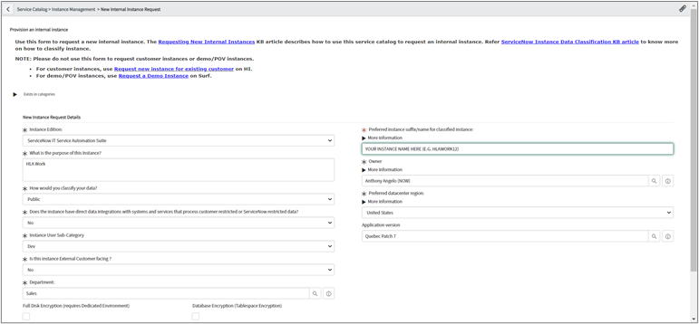

# Introduction

This document provides prescriptive guidance for using installing the HLA Workshop

# Prerequisites

Following is a list of prerequisite tools and accesses needed to perform a full HLA Workshop installation.This document provides prescriptive guidance for using installing the HLA Workshop:

* Access to an AWS Account with full admin privileges
* AWS CLI
* Bash Terminal Access (e.g., WSL for Windows, MacOS Terminal or another Linux)
* Terraform (e.g., Terraform v0.12.31)
* Ansible (e.g., v4.5.0)

# Deploy your NOW Instance

## Request a new NOW Instance

1. Navigate to NOW HI [https://support.servicenow.com/now](https://support.servicenow.com/now)
1. Search for "new internal instance request"
1. Request a new instance as follows, using the latest available application version:

